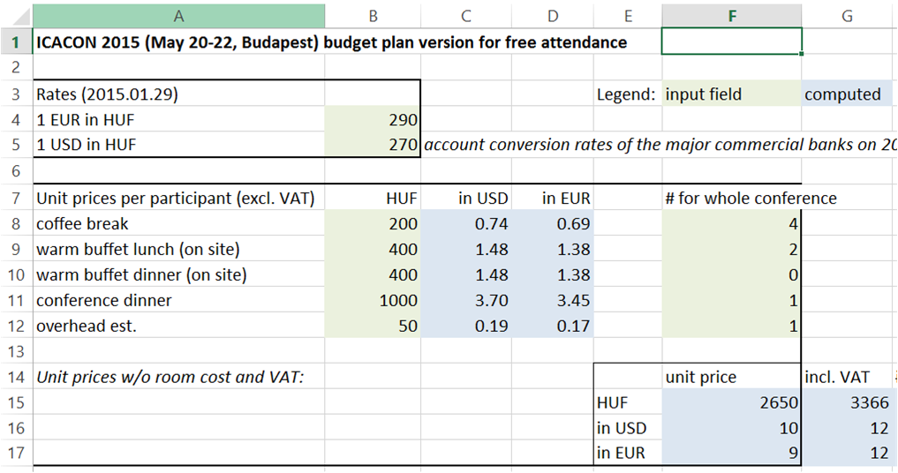

<!--
###############################################################
# R markdown script for the static version of the presentation
# held on Shiny at BI Forum 2015 Budapest
#
# Author: Imre Kocsis
# Date: 2015.10.20.
#
# Source and markdown code fall under the Apache License 2.0
# http://www.apache.org/licenses/LICENSE-2.0.html
#
# Graphic assets (including all figures) fall under
# Creative Commons Attribution-NonCommercial-NoDerivatives 4.0 International
# http://creativecommons.org/licenses/by-nc-nd/4.0/
#
# The name "Quanopt" and the Quanopt logo are trademarks of
# Quanopt Inc. (http://www.quanopt.com)
###############################################################
-->
# About us

## The company

- system/process analysis and optimization "consulting"

- automotive tooling development

- **R&D spinoff**
    + founders: professors & and lecturers
    + [**Dept. of Measurement and Inf. Systems**](http://www.inf.mit.bme.hu) @BME
    + course highlights: 'Big Data' Analysis Techniques, Cyber-Physical Systems, Intelligent Data Analysis, System Modelling

> - **[Budapest R meetup](http://www.meetup.com/budapest-users-of-r-network/)**: pizza, beer, presentations, 2 organizers

## Data analysis competencies at Quanopt
<div style="width: 100%;">
<div style="width: 50%; float: left; display: inline-block;padding-right:30px;">
**Critical cloud applications**

Manufacturing processes

Electronic equipment testing

Effort models for safety-critical software development processes

Fraud detection for service provider
</div>
<div style="width: 40%;display:inline-block;">

</div>
</div>

## Quanopt and R
You touch data - you have to speak some R (and you will see the light, we promise)

But a **manageable** investment - stats is the hard part, lang is easy

- Main use cases
    + **Visualization**: R is nigh unbeatable
    + "Exploratory Data Analysis"
    + Modeling - from descriptive models to [neural networks](http://www.inside-r.org/howto/time-series-analysis-and-order-prediction-r)
    + Data cleaning and tidying

# Shiny: an overview

## Shiny: a web framework for R
From [RStudio](http://shiny.rstudio.com/)
<br><br><br>
Web page layout and logic: write an R function

Server logic: write an R function

Page updates: reactive network of variables (as in Excel)
<br><br><br>
Run locally (RStudio!) / on shiny server / <http://shinyapps.io>

## A simplistic example
<div id="wrap">
<div id="done" class="smallercode" style="width: 50%; float: left; display: inline-block;">
ui.R
```{r, eval=FALSE}

shinyUI(fluidPage(
  selectInput("iris_mvar",
    "Iris property:",
    choices=colnames(iris)[1:4]),
    plotOutput("boxplot")))
```
server.R
```{r, eval=FALSE}
shinyServer(
  function(input,output){
    output$boxplot <- renderPlot(
      boxplot(get(input$iris_mvar) ~
      Species, data=iris))}))
```
</div>

<div id="dtwo" style="width: 50%; display: inline-block;">

<div class="imagestretch">

</div>

</div>
</div>

## Reactive programming
<div class="imagestretch">

</div>
Note: prices have been obfuscated

## Reactive programming
<div class="imagestretch">

</div>

## Reactive programming
<div class="imagestretch">

</div>

## Tweets mentioning "BudapestBI" - query with button
<div class="imagestretch">

</div>

## The code - server
```{r, eval=FALSE}
function(input, output){
    ###<b>
    currenttweets <- reactive({
      a <- NULL
      if(input$goButton > 0) {
        a <- bitweeters()}
      a
    })
    ###</b>
    
    output$biplot <- renderPlot({
      p <- qplot(screenname, data=currenttweets(), geom="bar")
      if(input$rotate) {p <- p + coord_flip()}
      print(p)
    })
```

## And for the sake of completeness
```{r, eval=FALSE}  
library(twitteR)
library(ggplot2)
    
bitweeters <- function(){
  origop <- options("httr_oauth_cache")
  options(httr_oauth_cache=TRUE)
  setup_twitter_oauth(conskey,conssecr,actok, acsecr)
  options(httr_oauth_cache=origop)

  ###<b>  
  tweets <- searchTwitter("BudapestBI", n = 100)
  ###</b>
  
  scrn <- sapply(tweets, screenName)
  crtd <- sapply(tweets, created)
  
  data.frame(screenname=scrn, created=crtd)
}
```

## Invalidation and recomputation
<div class="imagestretch">

</div>

## Other technicalities
- you can isolate the usage of a reactive var

- observers for side effects upon changes

- all the usual HTML inputs

- reasonable layout control

- reasonable set of outputs (with renderers) + htmlwidgets

- UI customization: HTML, JavaScript, CSS

- server function can have session parameter

- **important, but not covered: interactive graphics**

## Dynamic UI | or towards intractable hacking
<div class="imagestretch">

</div>

## renderUI for uiOutput
```{r, eval=FALSE}
function(input, output) {
  output$colselect <- renderUI({
    if(input$dataSelect == "cars") {
      selectInput("colSelect", "Select column:", names(dataframe1))
    } else {
      selectInput("colSelect", "Select column:", names(dataframe2))
    }
  })
  
  output$selected <- renderText({
    paste("You have selected: ", input$colSelect)
  })}
```

Could be different control types

And you can do cascading (**but don't**!)

# Use case #1 | EDA on public cloud benchmark campaigns

## Scenario
Cloud automation & availability project

An awful lot of perf. benchmark campaigns

To specify "the plots" for the Big BI DW Tool

R/Shiny begun as a band-aid


## Results


## Lessons learned
Very positive reception (Because shiny.)

In the given context: visualization >> "statistics"

First usable prototypes: very fast
  
Put it in a VPN - and suddenly it's a tool for **collaboration**
<br><br><br>

DB normalization and evolution massively worked against us

Deep, dynamic tree of DB-driven input controls: **AVOID!**

The whole thing got a bit sluggish (mostly ggplot2)

# If it works... (?)
## Similar projects, similar usage
<div>
<div style="width: 45%; float: left; display: inline-block;padding-right:30px;>
Electronic equipment testing (BIG data)

**Currently: fault injection on telco cloud applications**
</div>
<div style="width: 45%; display: inline-block;padding-right:30px;>

</div>
</div>
<br><br>
Web-based, "mouse-only" exploration

Small teams, project-internal usage; findings recorded separately

Source of all griefs: ID variables

# "Decision making support" | Let stakeholders convince themselves
## Educational cloud: Apache VCL
<center>

</center>

## How do students behave?


## The app
<div class="imagestretch">

</div>

# My impression of shiny
## Shiny: pro's
- Inside its design envelope: a breeze

- For me this includes no JavaScript

- Almost full R ecosystem

- By far not only "toy apps"

- ... But you probably want to stop at "workgroup applications"

## Shiny: con's and things to keep in mind
- No notion of
    + page flow (single page)
    + analysis flow
    + recording & replaying app state

- Keep layout dynamics unsophisticated

- Is the reactive model really enough for you?

- You still develop R (with "reactivity") - maintenance?

## Shiny: con's and things to keep in mind
- Stepping out of the box: R scripting morphs into web development

- Don't confuse it with full-fledged tools (no Watson for free)

- optimal case: your code and data in R; OR you need something from R

- This can be simply ggplot2, mind you

- Server/PaaS pricing

- (Interactive graphics - incl. linked selection & highlighting)

## Final thoughts
- Fun! :)

- Check it out: <http://shiny.rstudio.com>

- Professional setting: think about the risks (and whys)

- Under development: making objects of the analyzed system first-class citizens in shiny-based visualization

- Currently: too observation-based (interpretation?)

## Thanks
<br>
<http://quanopt.com>

Dynamic presentation: https://github.com/imrekocsis/biforum2015

<br>
**Mail**<br>
kocsis@quanopt.com<br>
ikocsis@mit.bme.hu
<br>
<br>

**Special thanks from the team to**
<br>
László Gönczy, Gergő Kincses, Ágnes Salánki, György Nádudvari
